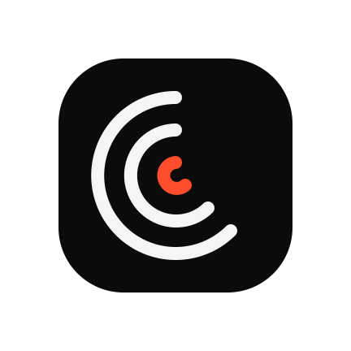
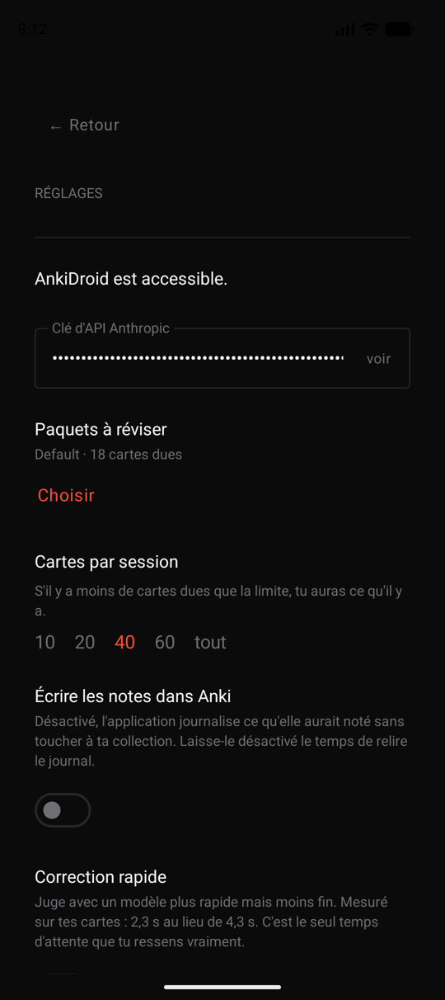
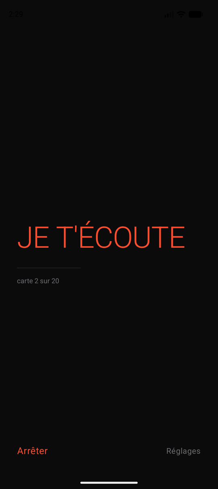
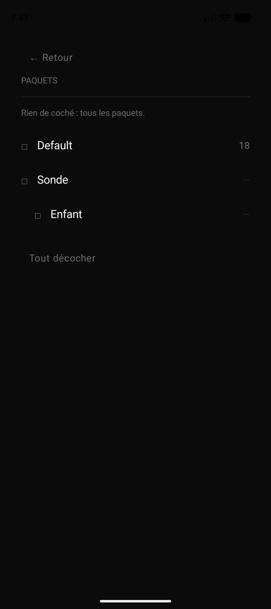

<p align="center">
  
</p>

<h1 align="center">Sillon</h1>

<p align="center"><em>Le sillon se creuse à force d'y repasser</em></p>

<p align="center">
  <strong>Français</strong> · <a href="README.en.md">English</a>
</p>

<p align="center">
  
  
  
  
  
  
</p>

---

App Android qui **t'interroge à l'oral sur tes cartes Anki dues pendant que tu conduis**.
Elle reformule chaque carte en question parlée, écoute ta réponse, la juge, annonce la note
qu'elle propose — et te laisse la corriger d'un mot avant qu'elle ne parte dans Anki.

Rien à toucher, rien à regarder. La session se lance à l'arrêt ; tout ce qui suit est vocal.

Le nom dit la mécanique : un sillon se creuse à force d'y repasser, et c'est aussi celui que
suit l'aiguille. L'icône ne dessine rien d'autre — trois arcs concentriques, le plus profond
en couleur.

## Le principe

```
carte due  →  reformulée en question orale  →  énoncée
                                                  ↓
        note écrite dans Anki  ←  correction vocale  ←  jugée  ←  réponse parlée
```

Quatre décisions portent tout le reste.

**Le modèle propose, le code dispose.** Le LLM ne touche jamais la collection. Il rend un
objet JSON ; le code le valide, borne la note au nombre de boutons de la carte, et la
recalcule depuis le verdict si elle est absente ou aberrante.

**Les écritures ont un tour de retard.** La note d'une carte n'est écrite qu'au moment où tu
réponds à la suivante. C'est ce délai qui rend le retour en arrière possible, alors que
l'API AnkiDroid n'offre aucune annulation après coup.

**Le mode journal est le défaut.** Les premiers trajets n'écrivent rien : ils enregistrent
ce que l'application *aurait* noté, pour que tu juges sa fiabilité sur tes propres fiches
avant de lui confier ton calendrier de révision.

**Une panne ne ressemble jamais à un silence.** Micro refusé, service de reconnaissance
absent, réseau coupé, note refusée par AnkiDroid : chacun se signale, s'annonce et se
retrouve dans le journal. Confondre panne et silence ferait défiler un trajet entier en
notant tout « à revoir », sans un mot d'explication.

Le mode dégradé ne vaut que pour la carte où la panne a eu lieu : chaque nouvelle carte
retente le modèle, donc une coupure de dix secondes sous un pont ne condamne pas le trajet.

## À quoi ça ressemble

<p align="center">
  
  
  
</p>

Un mot d'état, un filet, le rang de la carte. La couleur ne sert qu'à une chose : signaler
que l'application écoute.

## Ce que tu peux dire

| Pour | Dis | Quand |
|---|---|---|
| Corriger la note | « à revoir », « faux », « difficile », « bien », « facile » | après le verdict |
| Réentendre la question | « répète », « pardon » | pendant la réponse |
| Réentendre le verdict | « répète » | après le verdict |
| Passer sans noter | « passe », « suivante » | pendant la réponse |
| Te faire expliquer | « explique », « je sèche » | pendant la réponse |
| Revenir sur la carte précédente | « reviens », « la précédente », « carte d'avant » | les deux |
| Te faire réexpliquer la précédente | « explique la précédente », « c'était quoi déjà » | les deux |
| Annuler la note précédente | « annule » | les deux |
| Terminer | « stop », « terminé » | les deux |

Une commande n'est reconnue que si elle constitue toute la phrase : « je ne suis pas sûr,
passe » compte comme une réponse. Sinon la moitié des réponses déclencheraient une commande.

La liste complète vit dans l'application, sous Réglages → « Ce que tu peux dire ». Elle est
produite à partir du parseur lui-même : une notice recopiée à la main finit par annoncer des
mots qui ne marchent pas, et au volant on ne peut pas savoir si c'est le mot, le micro ou le
bruit qui a échoué.

« reviens » s'écoute **à tout moment où l'application t'écoute**, y compris au milieu de la
question suivante. Elle ouvre une parenthèse sur la carte d'avant, puis réénonce la question
en cours : tu ne perds pas la carte où tu en étais.

## Le LaTeX, énoncé et non épelé

Les fiches de prépa sont écrites en notation mathématique. Lues telles quelles, elles
donnent « backslash cos ». Le prompt interdit au modèle toute notation brute ; quand le
réseau tombe, un convertisseur maison prend le relais.

```
\(\sin(2a) = 2\sin(a)\cos(a)\)
  → « sinus de 2 a égale 2 sinus de a cosinus de a »
```

## Architecture

| Module | Rôle |
|---|---|
| `:core` | Kotlin/JVM pur, **zéro import `android.*`**. Modèle, machine à états, mémoire de session, parseur de commandes, verbalisation des formules, choix des paquets. |
| `:app` | Android. Adaptateurs seulement : ContentProvider AnkiDroid, synthèse et reconnaissance vocales, client Claude, journal, service de premier plan, interface Compose. |

Cette frontière est ce qui rend la boucle testable : une session complète se rejoue en
quelques millisecondes, sans émulateur, sans micro et sans réseau, à travers six ports
doublés.

```bash
./gradlew :core:test               # 154 tests, sans Android
bash scripts/prepare-emulator.sh   # installe AnkiDroid sur l'émulateur
./gradlew :app:connectedDebugAndroidTest
```

Les tests instrumentés tournent contre un **vrai** AnkiDroid : ils lisent des cartes dues,
écrivent une note, et vérifient que la carte notée disparaît de la file.

## Ce qu'il te faut

AnkiDroid installé sur le même téléphone, Android 12 ou plus, et une clé d'API Anthropic.
La clé est stockée chiffrée sur l'appareil et ne quitte jamais le téléphone que pour
l'API. Aucune carte n'est envoyée ailleurs.

`docs/INSTALLATION.md` détaille la prise en main, commande par commande.
`docs/conception.md` dit pourquoi l'application est faite ainsi.

## Licence

MIT.
